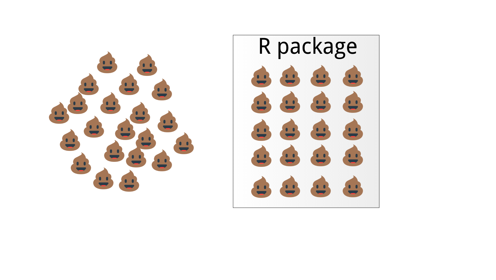
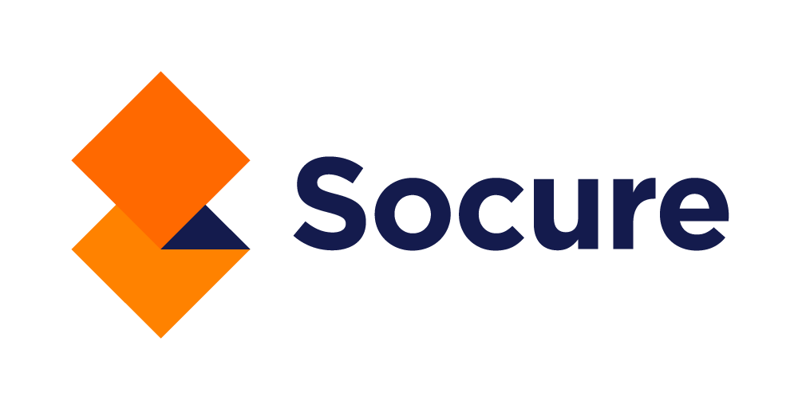

background-image: url("imgs/Happy Thought.jpg")
background-size: cover
class: bottom, hide-logo

.boxed[Technical Debt is a Social Problem]

<br>
---

# Technical Debt is a Social Problem

## Gordon Shotwell

## `r fontawesome::fa("link", fill = "#1DA1F2")`   [techdebt.shotwell.ca](techdebt.shotwell.ca)

## `r fontawesome::fa("twitter", fill = "#1DA1F2")` [@gshotwell](https://twitter.com/gshotwell)

???
- Technical debt is a major obstacle for using R in industry
- Even if you know what to do it's very difficult to get it done
- This is because it's fundamentally a people problem, not a computer problem

---
class: middle, center

# Most technical debt is a failure <br>to *communicate* or to *consider*

---

# Communication

--

- Bad documentation 

--

- Poor test coverage

--

- Code style 

- Project organization

???

- These are all ways of communicating with other people about the machines
- We should judge the success or failure of these artifacts by whether the interpersonal communication is successful
---

# Consideration
--

- Code isn't robust

--


- Code can't be updated easily

--


- Doesn't solve future problems

--


- Fragile dependencies

- Doesn't scale

???
- Our solutions will always solve our problems, but they often don't solve ofter people's problems
- If you do a better job considring other people's needs and abilities there will be less debt
- Our systems are robust when they are independent of the particular person who developed them

## Segway

- Realizing that technical debt is social also gives us insight into why it's so hard to pay back. 
- Paying back technical debt is more about relating with people than with machines
- People are fickle and biased
---
class: center
# Status Quo Bias

### "I like my hair the way it is thanks"

```{r, echo = FALSE, out.width = "600px"}

```


???
- The people who use the current system have already paid the price of learning it so they underestimate how difficult it is for a new person. 

---
class: center
# IKEA Effect

### "My Po&auml;ng is the best Po&auml;ng."

```{r, echo = FALSE, out.height = "400px"}

```

???
- People overvalue things that they have built. 
- Investing your ego in something makes it seem awesome
- This is why engineers prefer to build bad products rather than buy good ones
---
class:  middle

.pull-left[
```{r, echo = FALSE, out.width = "500px"}

```
]

.pull-right[
# Parenting Effect
<br><br>
### "When you watch something grow up, you forgive the mess"
]

???
# Segway
- The result of all of this is that it's never a fair fight
- The debt has the advantage, and it's not enough to do just a little better
- To succeed you have to dramatically exceed the status quo. 
- How do you do that?

---

# Build delightful products

--
- One-step setup

- Clear problem

- Obvious first action

--

- Path to mastery

--

- Help is available


- Never breaks

 
???
- How do you achieve this goal?
- Three part plan

---
<br>

--

## 1) Find the right beachhead


--
 
## 2) Separate users and maintainers


--
 
 
## 3) Empathize with the debtor

---
background-image: url("imgs/Pier-1.jpg")
background-size: cover
class: bottom

.boxed[Find the Right Beachhead&nbsp;&nbsp;&nbsp;&nbsp;&nbsp;<br><br>]

???
- A beachhead is not about solving the problem, but carving out a place from which you can solve it. 
- It gives you time to build trust, set up infrastructue, and make mistakes in a low-risk setting. 

---
background-image: url("imgs/socure_research_code.png")
background-size: cover
# Find the right beachhead

???
Socure story
---

# Find the right beachhead
--
<br>
- Small, contained project

--

- Big improvement in small area

--

- Orphan or greenfield

--

- External pressure

???

Continue Socure story with putting database functions and credential managers in the database. 

---
background-image: url("imgs/Bike shop.jpg")
background-size: cover
class: bottom
.boxed[ Separate users and maintainers<br><br>]


???
- To build delightful products we need to treat intenral products more like external products. 
- Each system should have a written down list of maintainers
- Everyone else is a user
- These two groups abide by a basic and holy contract
---
class:  center, left
--

# <br><br>Users get coddled.

--

# <br>Maintainers get opinions.


???
- We all want to sit between these two things
- We want to be coddled AND have opinions
- We want to make decisions, but we don't want deal with the consequences of those decisions
- We want to write code but we don't want to write the test. 
- This contract says you must pick one or the other
---

# Being a good maintainer

--

- Responsible for delight

--

- Product responsibility


- Product authority

--

- Never blame the user

- Never ask the user to maintain
---

# Being a good user

--

- Define delight

--

- Don't be too smart!

- Don't work too hard!

--

- Ask about the *problem* not the *solution* 

--

- Complain without embarrassment

- Refuse to read source code

???
- It's challenging to turn your developer brain off when you are a user. 
- It is rarely worth your time to debug a system that you do not maintain

---
class: middle, center

### If people do not welcome your input on code style, <br>you are a user.

---
# Useful questions:
--
<br>

 .large["Can we use tabs instead of spaces?"]

--

 .large["Have you thought about Python Black?"]

--

 .large["My IDE really works best with 87 character line lengths] ..."

--

 .large["The data.table syntax is much more concise than tidyverse"]


---
# Can you add this function?
--
```{r, echo = FALSE}

```
---
background-image: url("imgs/Red Cross.jpg")
background-size: cover
class: bottom
.boxed[Empathize with the debtor&nbsp;&nbsp;&nbsp;&nbsp;<br><br>]
---

# Empathize with the Debtor
<br>
- Fear makes learning impossible 

--

- Empathy diffuses fear
--

- More often than not the debtor is you

???
- You have to appreciate what people do and where they're coming from for them to trust you
- If they don't trust you, you will fail. 
- There's a lot about the current set up that you need to learn from
---

# Thank your code
--
<br>
- Technical debt is a good sign

--

- Thoughtful people doing their best


--

- Thank the debt

???
- The fact that you're paying back technical debt means you haven't declared technical bankruptcy. 
- It's a sign of a successful product, and a successful team
- All we can ask of people the problems in front of them with the skills that they have
- All we can ask of code is to get us to the next step
---
class: .hide-logo
background-image: url("imgs/socure_research_code.png")
background-size: cover

???
- Much of this code was developed at a time when Socure was urgently trying to develop a marketable product
- The company did that and now has one of the best models in the market
- This code won us customers and investment
- It did it's job
---
class: hide-logo

```{r, echo = FALSE, out.width = "250px"}

```

### Help us eliminate identity fraud: 

### [socure.com/about/careers](socure.com/about/careers)

### Get in touch

### `r fontawesome::fa("link", fill = "#1DA1F2")`   [blog.shotwell.ca](blog.shotwell.ca)

### `r fontawesome::fa("twitter", fill = "#1DA1F2")` [@gshotwell](https://twitter.com/gshotwell)

---
# Credits

Baby photo is copyrighted and may not be reproduced without consent

Black and white photos from the [Library of Congress](https://www.loc.gov/photos/)

All other photos from [Wikipedia](https://www.wikipedia.org/)

Presentation written using [Xaringan](https://github.com/yihui/xaringan/)


